<p align="center">
  
</p>

<p align="center">
  <a href="https://www.linkedin.com/in/gabrielle-caixeta-4994712b7">
    
  </a>
  <a href="mailto:gabrielle.scaixeta@gmail.com">
    
  </a>
  
</p>

---

## Sobre mim

Desenvolvedora de software com foco em **back-end Java**. No dia a dia trabalho com
**Spring Boot** construindo APIs REST, modelando regras de negócio e integrando com
banco de dados relacional — em um sistema bancário, onde consistência e rastreabilidade
dos dados não são opcionais.

Cursando **Sistemas de Informação**. Estudando arquitetura de software, testes
automatizados e boas práticas de código.

```java
public class Gabrielle {

    private final String funcao   = "Desenvolvedora Back-end";
    private final String[] stack  = { "Java 21", "Spring Boot", "PostgreSQL", "Angular" };
    private final String estudando = "Arquitetura de Software & Testes";

    public String filosofia() {
        return "A melhor forma de aprender é construindo.";
    }
}
```

---

## Stack

<table>
  <tr>
    <td valign="top" width="33%">

**Back-end**


  </td>
    <td valign="top" width="33%">

**Front-end**


  </td>
    <td valign="top" width="33%">

**Ferramentas**


  </td>
  </tr>
</table>

---

## Trilha de estudos

| | Tema | Status |
|---|---|---|
| ✅ | Lógica de programação e sintaxe Java | Concluído |
| ✅ | Pilares da POO — herança, polimorfismo, encapsulamento | Concluído |
| ✅ | Coleções, streams e expressões lambda | Concluído |
| 🔄 | Spring Boot — APIs REST, validação, camada de serviço | Em andamento |
| 🔄 | Testes automatizados com JUnit 5 e Mockito | Em andamento |
| 📋 | Arquitetura de software e design patterns | Próximo |
| 📋 | Docker e deploy de aplicações | Próximo |

<!--
  QUANDO TIVER PROJETOS, troque esta seção pela tabela abaixo:

  ## Projetos

  | Projeto | Descrição | Stack |
  |---|---|---|
  | **[nome](link)** | O que faz, em uma frase. | `Java` `Spring Boot` |
-->

---

## Estatísticas

<p align="center">
  
  
</p>

---

## 🐍 A cobrinha comendo minhas contribuições

<p align="center">
  <picture>
    <source media="(prefers-color-scheme: dark)"
            srcset="https://raw.githubusercontent.com/caixetss/caixetss/output/snake-dark.svg"/>
    <source media="(prefers-color-scheme: light)"
            srcset="https://raw.githubusercontent.com/caixetss/caixetss/output/snake-light.svg"/>
    
  </picture>
</p>

---

<p align="center">
  <i>"A melhor forma de aprender é construindo."</i>
</p>
